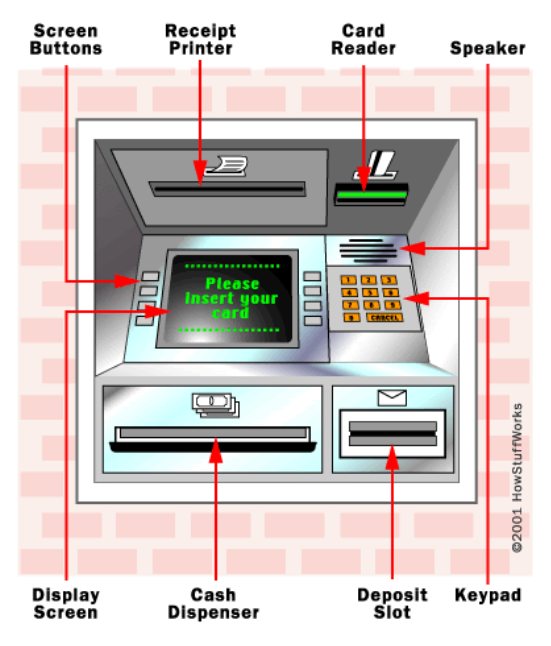
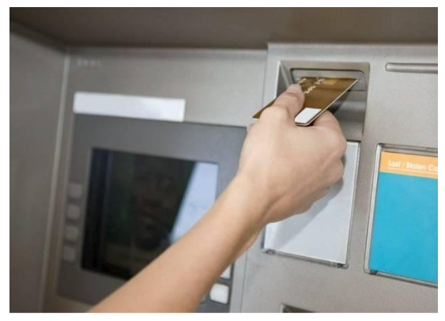
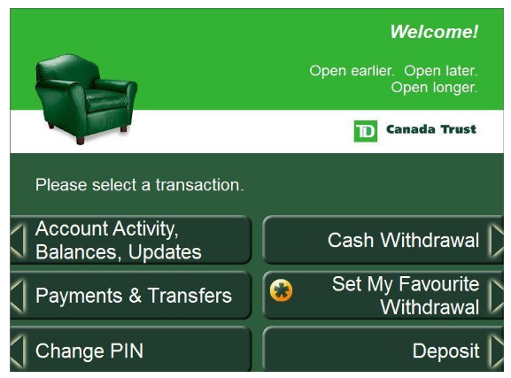
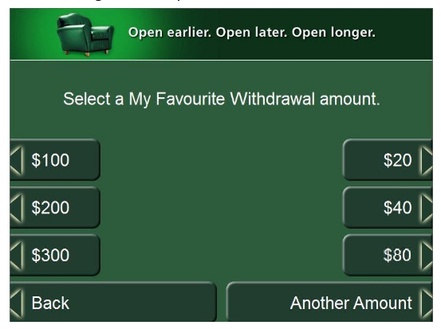
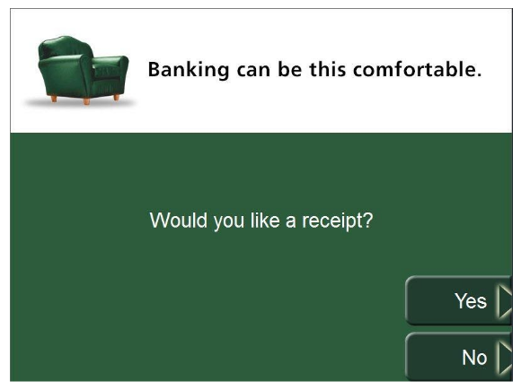
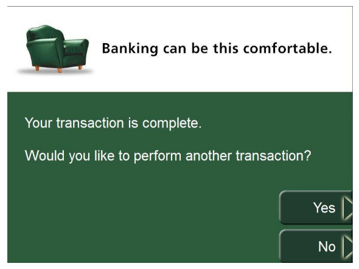

## Withdrawing Money from an ATM

This page describes how to withdraw money from an Automated Teller Machine (ATM).

### ATM Terminology

An ATM consists of the following parts:
- __Screen Buttons__: Where you select options on the display screen
- __Receipt Printer__: Where you retrieve your receipt
- __Card Reader__: Where you insert your ATM card
- __Speaker__: Where blind customers hear voice commands
- __Keypad__: Where you enter your password and other numeric values such as dollar amount
- __Deposit Slot__: Where you deposit money to the bank
- __Cash Dispenser__: Where you retrieve your money
- __Display Screen__: Where you view options for the transaction such as language and dollar amount

Before using an ATM, you should be aware of the following limitations:
- The amount you are allowed to withdraw may be subject to a daily limit
- You must have a valid ATM card which is not blocked
- There may be a transaction fee for withdrawing money from an ATM outside your bank’s network

### Withdraw Money

Follow the steps in this section to withdraw money from an ATM.

To withdraw money:

1. Put your card in the Card Reader as shown in the following figure: 
  
3. On the Display Screen, press the Screen Button next to English.
4. Enter your Password on the Keypad and click OK. One of the following occurs:
    - If the password is invalid, you will have two more chances to enter a valid password before your card is blocked and the transaction ends.
    - If the password is accepted, the following window opens:
   
5. Select Cash Withdrawal.
7. Press the Screen Button next to the dollar amount you want.
  
10. Take your money from the Cash Dispenser.
2. For a printed receipt of your transaction, press the screen button next to Yes.
  
4. Take the receipt dispensed at the Receipt Printer.
1. To finish the transaction, press the screen button next to No.
  
1. Take your card from the Card Dispenser. The transaction is complete.
